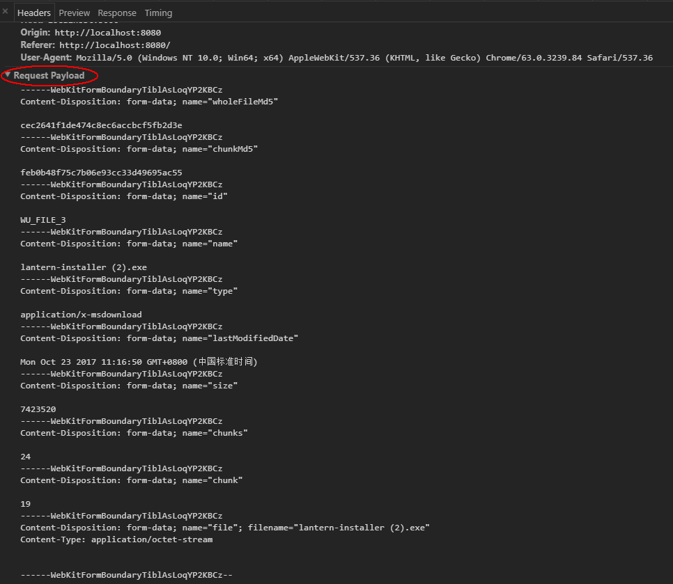

# 文件上传后端实现大概思路

## 检查上传文件夹

- 检查是否存在uploads文件夹，若不存在，创建它

## 前端post请求数据

- url: /upload , method: post , 数据格式为前端formData形式
- 请求携带的formData数据有如下（按照field添加顺序）

  - name: whole_file_md5 , dataType: string, description: '整个文件的md5'

  - name: chunk_md5, dataType: string, description: '文件分片的md5，文件不分片时，它等于whole_file_md5'

  - name: id , dataType: string, description: '文件的id'

  - name: name, dataType: string, description: '文件的名字，与filename值相等'

  - name: type , dataType: string, description: '文件的content-type类型'

  - name: last_modified_date, dataType: string, description: '文件的最后修改日期'

  - name: size , dataType: number, description: '文件的大小，以字节大小来算的'

  - name: chunks, dataType: number, description: '文件分片的总数量'

  - name: chunk, dataType: number, description: '文件上传的第几个分片，从0开始'

  - name: filename, dataType: string, description: '文件的名字'

  - chrome F12 图片截图如下(此图的参数命名是驼峰法，最终将是下划线写法)
    

- 接下来就是文件的数据部分了，Content-Type: application/octet-stream

## 解析post请求的formData数据

- 解析了formData对应数据，并进行变量赋值。

- size, chunks, chunk 传输过程可能被转换为字符串类型，后端需要处理为数字类型。

- 后端解析只需取出name字段对应的值(数据对象的key，如{filename: '1.txt'}中的filename)，由该值去读取formData中field的value(数据对象的value，如{filename: '1.txt'}中的1.txt)。

## 解析post请求的二进制数据

- 写入数据到文件前的的准备工作

  - 在uploads文件夹下，根据formData的whole_file_md5字段的值来创建文件夹，创建前，检查是否已经存在，存在则直接跳过不创建。（说明：whole_file_md5值作为文件夹，表明此文件夹下面将会存放跟正在上传的此文件相关信息，例如文件的分片文件、以及最后利用所有分片来合成的完整文件，即上传的最终目标文件）

  - 定义一个分片名字的变量chunk_file_name，用于作为分片文件名字
    - js的写法：chunk_file_name = `chunk_${chunk}_${chunk_md5}`，就是利用字符串'chunk' + formData中的chunk的值 + formData中的chunk_md5的值。

  - 利用chunk_file_name在此分片所属的文件的文件夹下创建分片文件。(如果文件不存在，则创建；存在则整个覆盖掉重头写入新数据)。

- 写入分片数据到分片文件里，分片较小写入速度很快。

  - 读取buffer写入的过程中，可以在写入过程前开始检查分片md5，检查一小段buffer，写入一小段。等分片buffer写入完毕时就得到分片md5值。

  - 当然上述做法也可改用：写入一个分片之后，再对分片进行md5检查。（鉴于分片小，检查速度快）

- 写入分片完毕后

  - 根据formData中的chunk_md5值判断是否与后端写入分片的md5一致。

  - chunk_md5值与写入分片的md5，若不一致，回复失败，直接删除已经写入的分片文件，放弃它。回复的格式如下

    ```js
    {
      status: 5003,
      data: {
        whole_file_md5: 'aaaaaa', // 来自formData
        chunk_md5: 'bbbbbb', // 这个是前端formData中的chunk_md5，非分片的校验结果
        chunk: 40 // 来自formData
      }
    }
    ```

  - chunk_md5值与写入分片的md5，若一致

    - 在回复前端请求之前，分片信息写入mongodb数据库，所有来自相同文件的分片的信息都记录在一条数据里，这条数据以whole_file_md5来标识查询，数据格式如下
      - [分片在mongodb的数据存储格式](#mongodb存储数据格式)

    - 回复格式如下；message回复字段可加上，注意data里面的值的数据类型。

      ```js
      {
        status: 200,
        data: {
          whole_file_md5: 'aaaaaa', // 来自formData
          chunk_md5: 'bbbbbb', // 这个是前端formData中的chunk_md5，非分片的校验结果
          chunk: 40 // 来自formData
        }
      }
      ```

  - 前端根据status来判断分片是否需重传，根据data来缓存分片的信息

  - 若分片文件的md5与前端的formData的chunk_md5不一样，

## mongodb存储数据格式

- 以前端js的形式来阐述这个数据对象

  - 在mongodb存储时要注意size, chunks, chunk_list_md5对象里面的key这些都是数字类型的。

  - 第一次接受分片后，需要创建此条数据，其他分片的信息都是通过更新chunk_list_md5对象来记录的，其中的key代表着分片的chunk，即分片的序号，value是该分片的md5，可来自后端分片校验或前端分片参数(因为只有两者的值的是一致的，才表示接受成功，往数据库写入分片信息)。

  - 后续分片信息更新，只需要根据前端参数whole_file_md5来查询mongodb的这条信息，接着往chunk_list_md5这个对象里继续插入新数据，插入时，对chunk_list_md5的里面的key从小到大排列（分片信息写入由于前端并发发送，未能保证顺序）。

```js

// 其实真正存储时，可以直接只要"75e7771d8f341e6ae0e6227ed60a0d08"里面的value就行

"75e7771d8f341e6ae0e6227ed60a0d08": {
    "whole_file_md5": "75e7771d8f341e6ae0e6227ed60a0d08",
    "id": "WU_FILE_0",
    "name": "文件说明.txt",
    "type": "text/plain",
    "last_modified_date": "Sun Oct 05 2014 20:41:04 GMT+0800 (中国标准时间)",
    "size": 49,
    "chunks": 1,
    "filename": "文件说明.txt",
    "chunk_list_md5": {
      0: "75e7771d8f341e6ae0e6227ed60a0d08"
    },
    "concat_status": "" // 合并成功为success,失败为fail,默认为空的
  },
```

## 处理分片合成的请求

- url: /merge , method: post , 数据格式为前端formData形式

- 请求携带的formData数据有如下（按照field添加顺序）

  - name: whole_file_md5 , dataType: string, description: '整个文件的md5，用于查找分片所在的文件夹，目前是以文件的md5来作为分片所属文件夹的名字'

- 根据formData的whole_file_md5值查询mongodb。

  - 先判断数据库中的chunk_list_md5的对象的数据的条数是否等于数据库里的chunks，若不等，无需继续合成，返回失败。
  - 若concat_status早已为success，则返回成功

- 根据查询的chunk_list_md5的数据中的key从小到大（分片的顺序），再根据key对应的value来寻找分片所在位置

  - 大概的写法：uploads/whole_file_md5值/chunk_key数字_key的值，这样就寻找到分片位置

- 根据查询的mongodb的信息中的name或者filename字段值为文件名字，在当前分片文件夹里（若在其他文件夹，则省去合并完毕的文件转移步骤）创建新文件（若存在直接覆盖掉），开始按照分片顺序写入每片的数据，可以边写入前边校验新合成文件的md5，也可以写入后再去校验新合成文件的md5。

- 文件合成过程需要测试2000M~3000M文件的所有分片合成消耗时间，防止请求等待超时。

- 若合成文件的md5与数据库的whole_file_md5值相等，说明合并成功，更新数据库的concat_status值为'success'；不相等说明合并失败，concat_status值为'fail'。

- 合并失败，可删除失败的合成文件，分片无需删除，留着做续传，返回失败结果；合并成功了，可删除所有该文件的分片，同时根据需要转移目标文件，以及删除目标文件分片所在的整个文件夹释放空间。

- 返回的结果格式：

```js
失败结果格式：

{
  status: 5003,
  message: '说明原因',  // 前端可用于展示处理
  data: {
    whole_file_md5: 'aaa' // 数据库中的whole_file_md5或者该合并请求中的whole_file_md5，两者一致的
  }
}

成功结果格式：

{
  status: 200,
  message: '文件上传成功',  // 前端可用于展示处理
  data: {
    whole_file_md5: 'aaa' // 数据库中的whole_file_md5或者该合并请求中的whole_file_md5，两者一致的
  }
}
```

## 前端断点续传与秒传的信息查询

- url: /upload , method: get , 数据格式为前端query查询形式

- query: whole_file_md5 , dataType: string, description: '整个文件的md5'

- 根据whole_file_md5查询mongodb找出对应的数据字段返回给前端，需要的字段有chunks, chunk_list_md5, concat_status 。

- 返回数据格式：

```js
找不到

{
  status: 404,
  message: '' // 可以不用内容
}

找到数据

{
  status: 200,
  data: {
    whole_file_md5: '', // 可来自query也可来自数据库
    concat_status: '', // 来自数据库有''、'success'、'fail'三种结果
    chunks: 2, // 来自数据库，数字类型
    // chunk_list_md5: {
    //   0: 'aaaa' // 注意返回的key是数字类型
    //   1: 'fdfdfdf'
    // }
    chunk_list_md5: [
      {
        chunk: 0,
        chunk_md5: 'dddd'
      },
      {
        chunk: 1,
        chunk_md5: 'aaa'
      }
    ]
  }
}
```
